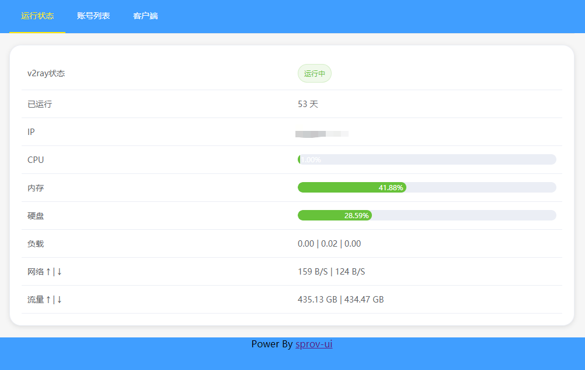
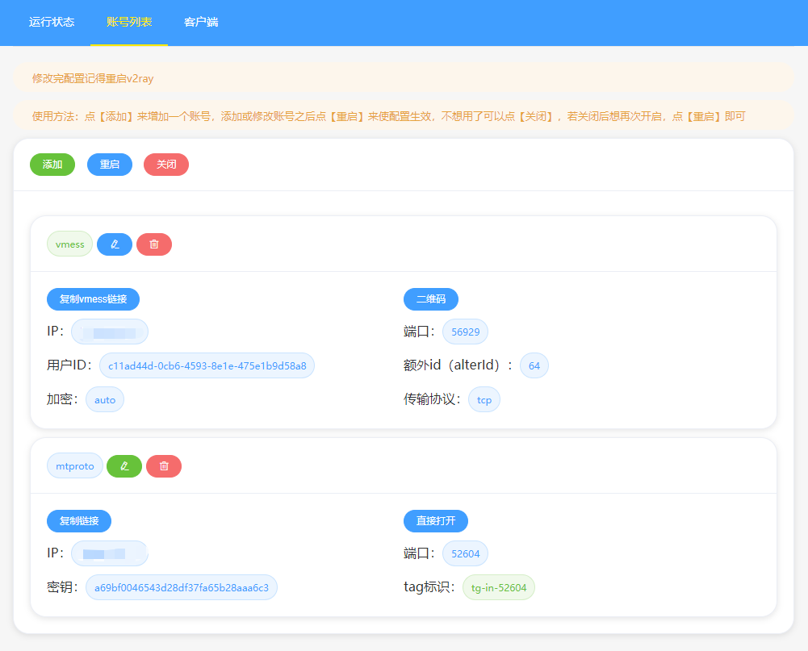

# sprov-ui
 一个支持多协议多用户的v2ray Web面板
 
# 详细教程
https://blog.sprov.xyz/2019/02/09/sprov-ui/
 
# 支持的功能
 - https 访问面板
 - 系统运行状态监控
 - 多协议、多用户管理
 - 禁用、启用单个账号
 - 支持设置监听的 IP（多 IP 服务器下）
 - 流量统计（支持所有协议）
 
## 支持的 v2ray 协议
 - vmess（v2ray 特色）
 - shadowsocks（经典 ss）
 - mtproto（Telegram 专用）
 - dokodemo-door（端口转发）
 - socks（socks 4、socks 4a、socks 5）
 - http（http 代理）

## 支持的 vmess 传输配置
 - tcp
 - kcp + 伪装
 - ws + 伪装 + tls
 - http/2 + 伪装 + tls
 
# 运行截图



# 支持的系统
>务必使用纯净版的系统，建议在 256MB 内存及以上的 vps 搭建，低内存情况下可能运作不良
 - CentOS 7（推荐）
 - Ubuntu 16
 - Ubuntu 18
 - Debian 8
 - Debian 9

# 一键安装&升级面板

>以下两条命令皆可，两者是一样的，只需要运行一个，如果其中一个有错误，可以运行另外一个。

>请务必使用 root 用户运行！
```
wget -O /usr/bin/sprov-ui -N --no-check-certificate https://blog.sprov.xyz/sprov-ui.sh && chmod +x /usr/bin/sprov-ui && sprov-ui

```
```
wget -O /usr/bin/sprov-ui -N --no-check-certificate https://github.com/sprov065/sprov-ui/raw/master/sprov-ui.sh && chmod +x /usr/bin/sprov-ui && sprov-ui

```

# Telegram 群组
https://t.me/sprov_blog

# Telegram 频道
https://t.me/sprov_channel
